# ⚔️ DebateME — Gamified AI Debate Trainer

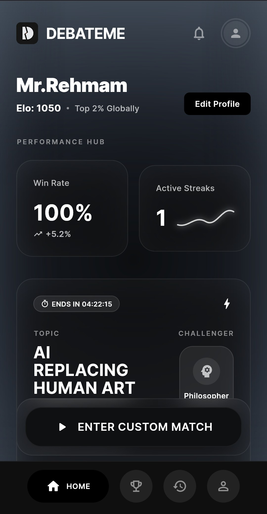

## 🎮 Overview

**DebateME** is a gamified, AI-powered debate training app built with Flutter. Battle adaptive AI personas in real-time debates, sharpen your rebuttal strategy with Steel-Man rounds, and track your Elo rating as you climb the global leaderboard.

Developed by **AbdulRehman (241-0911)**.

> **🔗 Try it live:** [debateme-15b75.web.app](https://debateme-15b75.web.app)

---

## 🎨 UI — Glassmorphism Dark Design

DebateME features a **premium dark-mode UI** built on a custom glassmorphism design system:

- **Frosted glass cards** with subtle transparency and blurred backgrounds
- **Monochromatic dark palette** — deep charcoal to slate-gray tones for a refined, distraction-free interface
- **Smooth micro-animations** powered by `flutter_animate` for screen transitions and interactive elements
- **Custom bottom navigation bar** with pill-shaped active indicator and icon-label pairing
- **Consistent typography hierarchy** with bold uppercase section headers and clean body text
- **Responsive layout** across mobile, tablet, web, and desktop

---

## ✨ Key Features

- **🤖 Adaptive AI Opponents** — Debate against four unique AI personas — The Philosopher, The Politician, The Scientist, and The Aggressor — each with a distinct debate style.
- **⚡ Steel-Man Rounds** — Mid-debate challenges that force you to summarize your opponent's argument fairly, boosting your final score.
- **📊 Performance Scorecard** — Post-match breakdown of Clarity, Logic, Rebuttals, and Fallacy Detection with percentage scores and a best-argument highlight.
- **🧠 AI Coach Feedback** — Detailed analysis of logical fallacies, strategic mistakes, and actionable tips to improve.
- **🏆 Elo Rating & Leagues** — Competitive ranking system with global leaderboard tiers (Master, Diamond, etc.).
- **📅 Daily Challenges** — Auto-generated debate topics with countdown timers and stance assignments.
- **📈 Performance Hub** — Track win rate, active streaks, and Elo progression over time.
- **👤 Guest Mode** — Try the app instantly without creating an account.

---

## 📸 Screenshots

| Sign In | Sign Up |
|:---:|:---:|
| 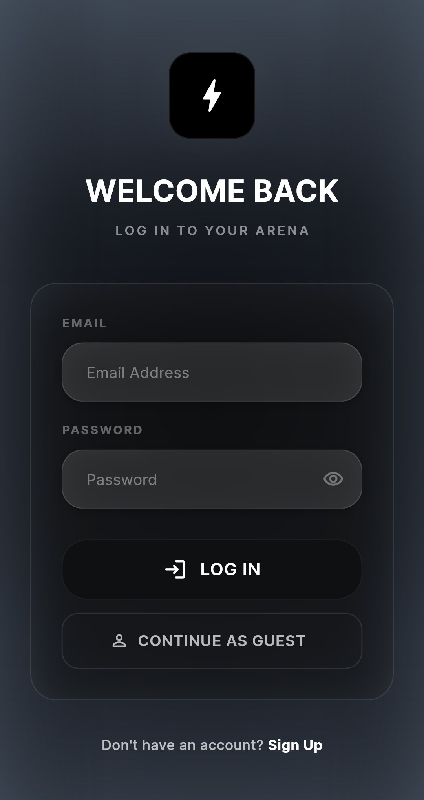 | 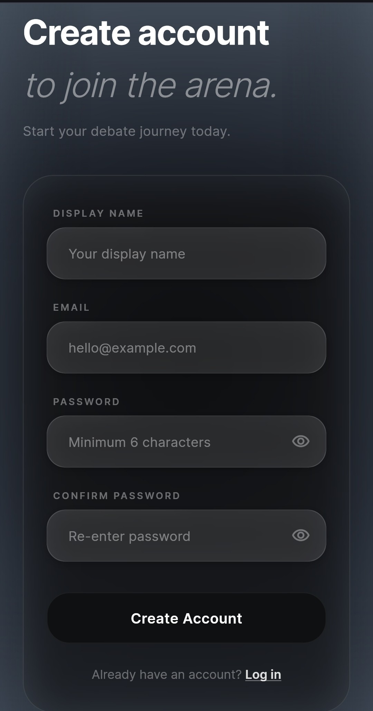 |

| Home Dashboard | Daily Challenge & Activity Feed |
|:---:|:---:|
|  | 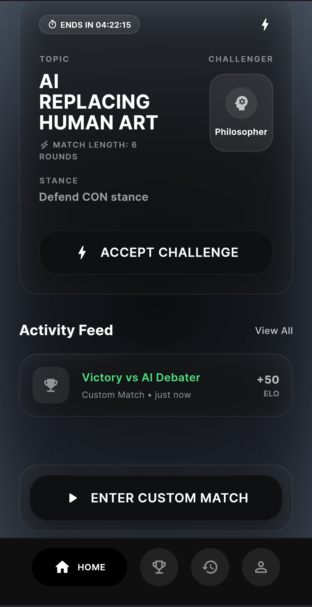 |

| Match Setup | Persona Selection |
|:---:|:---:|
| .png) | 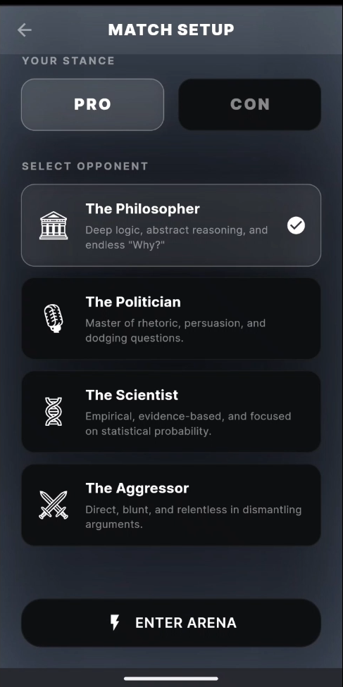 |

| Debate Arena | Steel-Man Round |
|:---:|:---:|
| 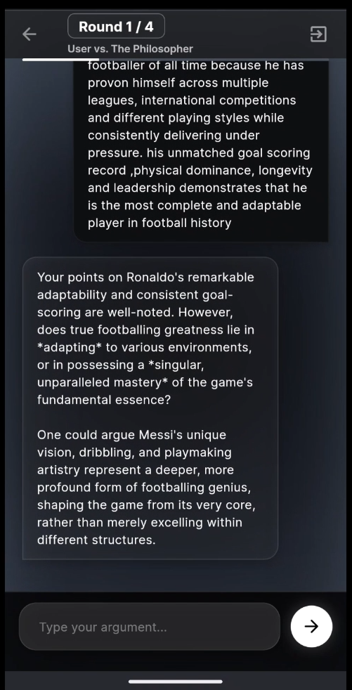 | 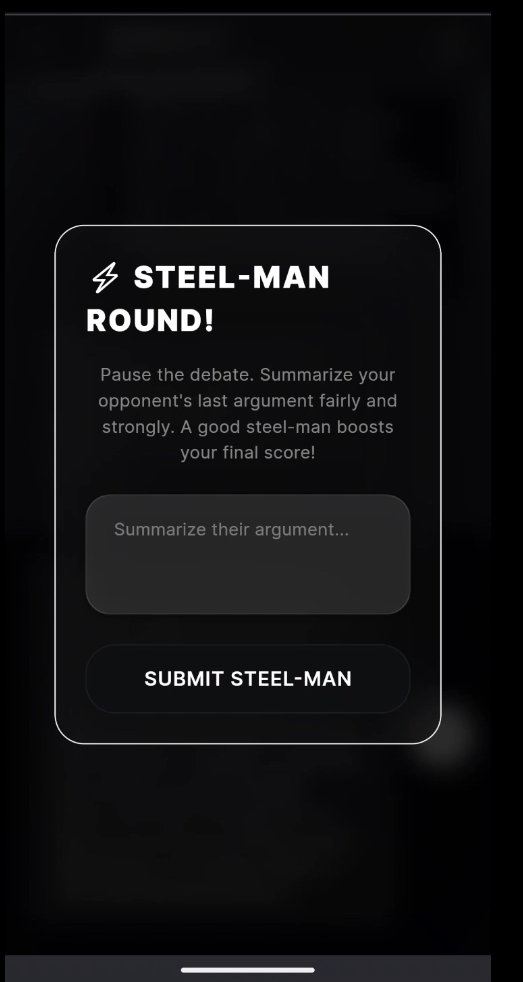 |

| Scorecard | AI Coach Feedback |
|:---:|:---:|
| .png) | 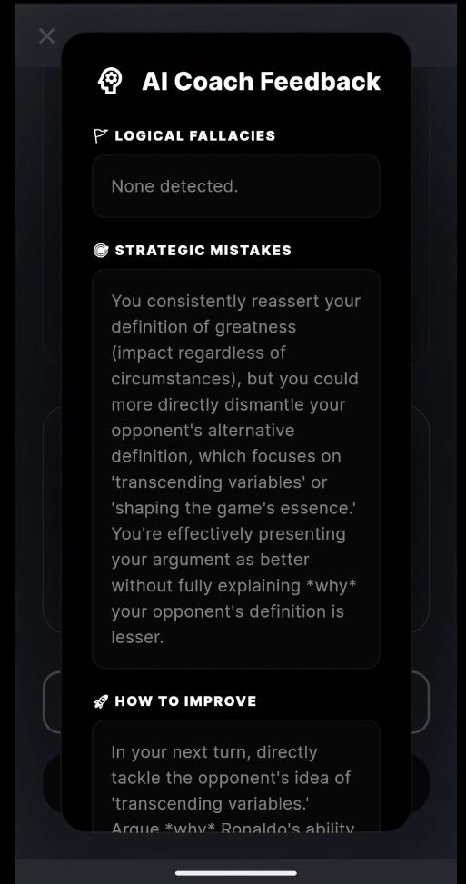 |

| League Rankings | Match History | Profile |
|:---:|:---:|:---:|
| 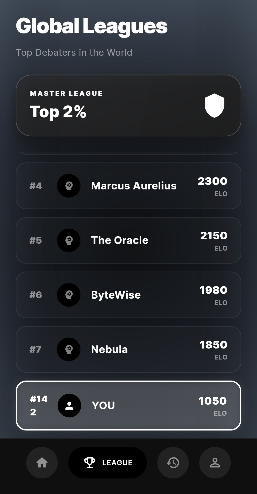 | 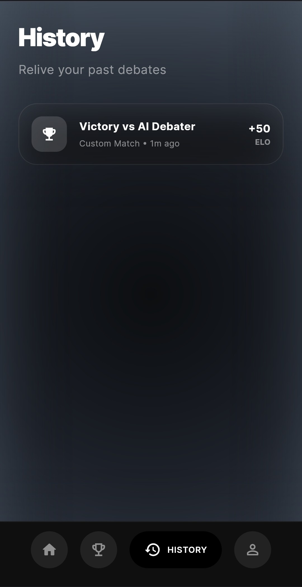 | 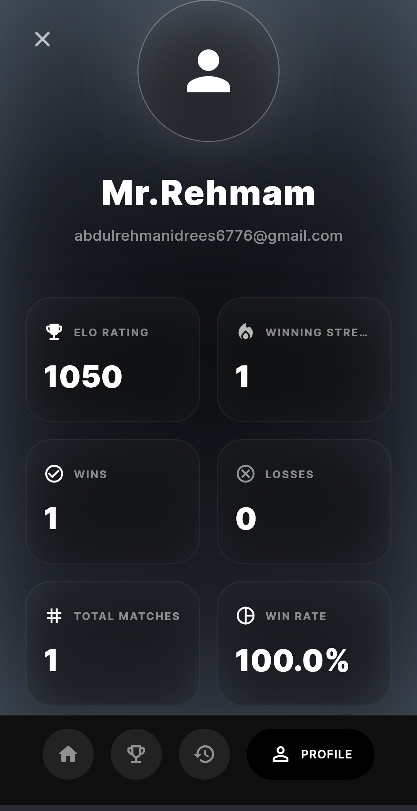 |

---

## 🛠️ Tech Stack

| Layer | Technology |
| --- | --- |
| **Framework** | Flutter (Android, iOS, Web, Desktop) |
| **Auth & Database** | Firebase Auth + Cloud Firestore |
| **Local Storage** | Hive |
| **AI Engine** | Google Gemini API (`google_generative_ai`) |
| **State Management** | Provider |
| **Animations** | `flutter_animate` |
| **Typography** | Google Fonts |

---

## 🗂️ Project Structure

```
lib/
├── main.dart                  # App entry point
├── firebase_options.dart      # Firebase config
├── core/
│   ├── constants/             # Design system tokens & app constants
│   ├── models/                # Data models (Match, User, etc.)
│   ├── services/              # Core service layer
│   └── theme/                 # App-wide theme configuration
├── services/                  # AI service & API layer
├── widgets/                   # Reusable UI components
│   ├── bottom_nav_bar.dart    # Custom bottom navigation
│   ├── glass_background.dart  # Glassmorphism scaffold
│   ├── glass_button.dart      # Frosted glass button
│   ├── glass_card.dart        # Frosted glass card container
│   └── glass_text_field.dart  # Themed text input
└── features/
    ├── splash/                # Animated splash screen
    ├── auth/                  # Login / Sign-up / Guest access
    ├── home/                  # Dashboard & performance hub
    ├── arena/                 # Quick-match arena
    ├── match_setup/           # Topic, stance, opponent selection
    ├── game/                  # Live debate arena
    ├── scorecard/             # Post-match results & coach analysis
    ├── history/               # Match history feed
    ├── league/                # Global leaderboard
    └── profile/               # User profile & stats
```

---

## 🚀 Getting Started

### Prerequisites
- **Flutter SDK** (stable channel)
- **Firebase** project configured (Auth + Firestore)
- **Gemini API key** from [Google AI Studio](https://aistudio.google.com/)

### Setup
1. **Clone the repository:**
   ```bash
   git clone https://github.com/Abdulrehman0911/DebateME.git
   cd DebateME
   ```
2. **Install dependencies:**
   ```bash
   flutter pub get
   ```
3. **Create your environment file:**
   ```bash
   cp .env.example .env
   ```
4. **Fill in `.env` values:**
   - `GEMINI_API_KEY` — your Google AI Studio key *(required)*
   - `GEMINI_MODEL` — model override *(optional, defaults to `gemini-2.5-flash`)*
5. **Run the app:**
   ```bash
   flutter run
   ```

---

## 🌐 Web Deployment (Firebase Hosting)

1. Build for web:
   ```bash
   flutter build web
   ```
2. Deploy:
   ```bash
   firebase deploy --only hosting
   ```

Hosted at: [debateme-15b75.web.app](https://debateme-15b75.web.app)

---

## 👨‍💻 Developer
- **Name**: AbdulRehman
- **Roll Number**: 241-0911

---

> [!IMPORTANT]
> Never commit your `.env` file. Use `.env.example` as a template for onboarding. Rotate API keys immediately if exposed.
