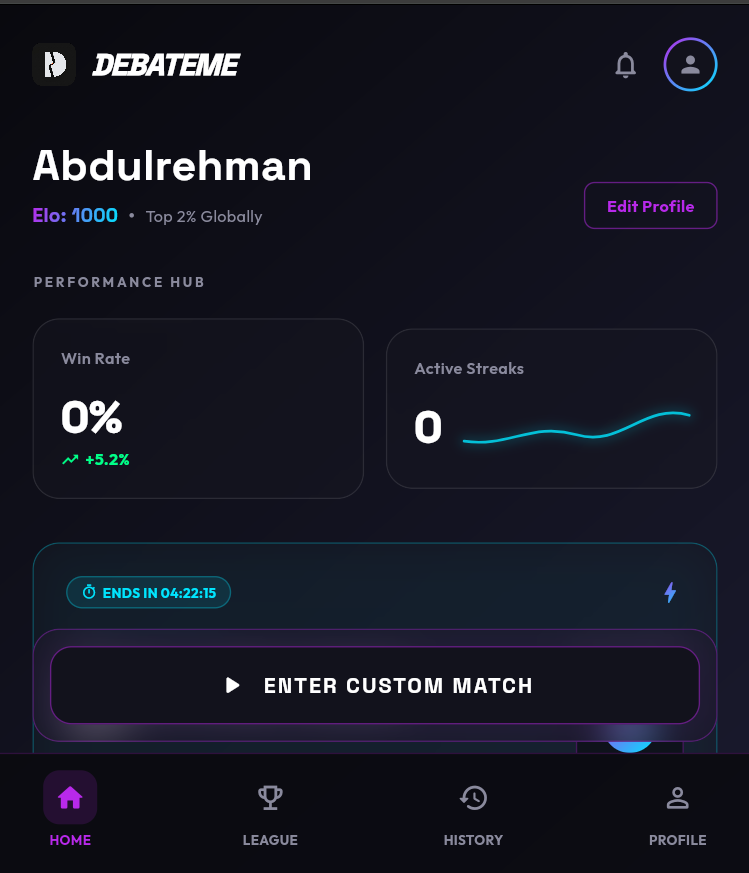
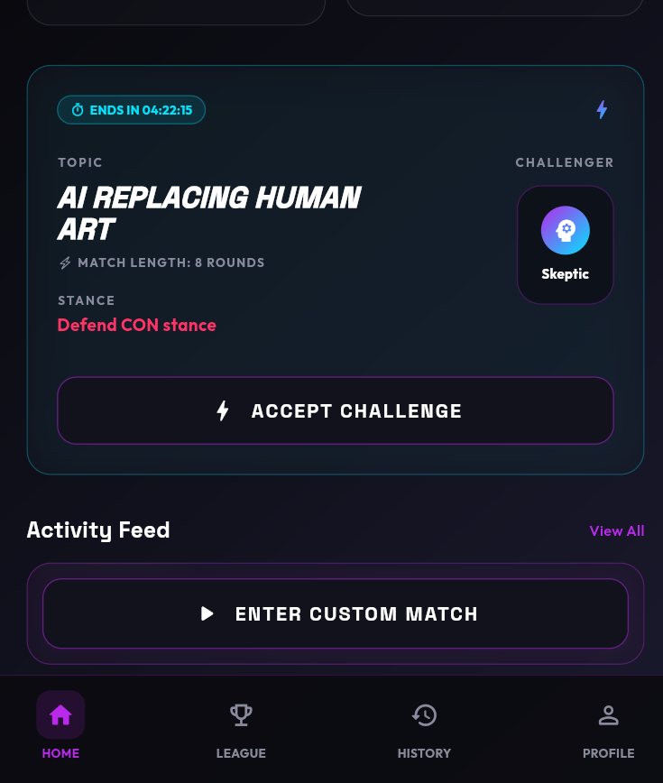
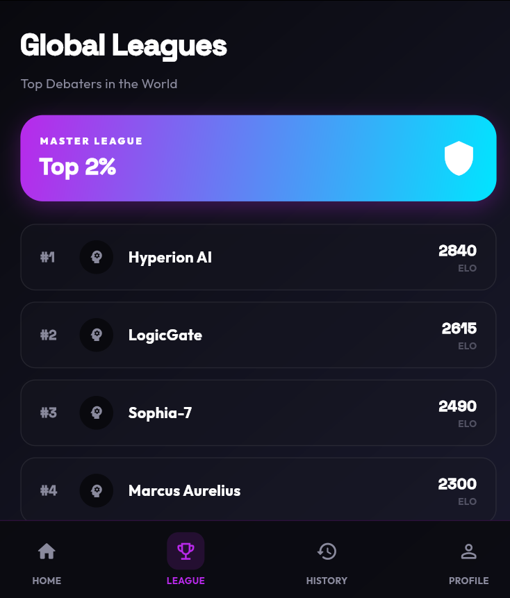
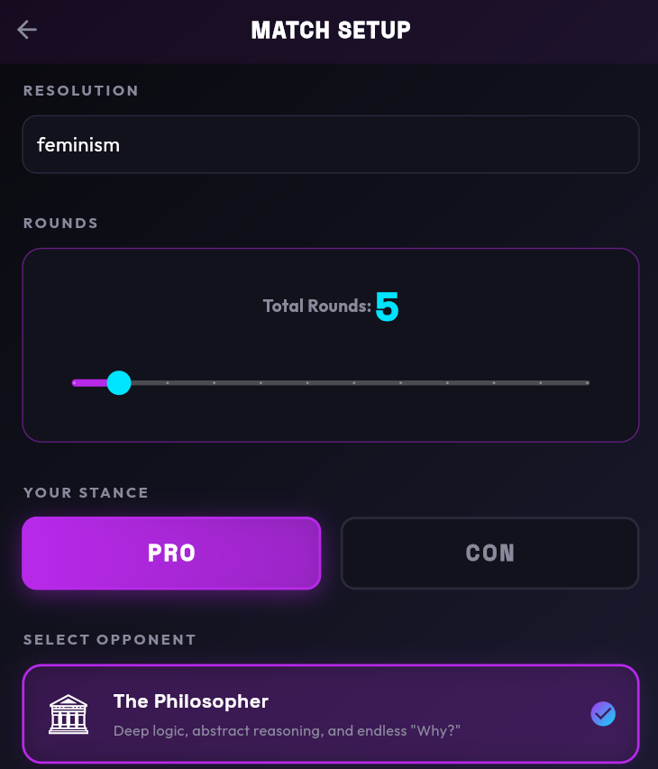
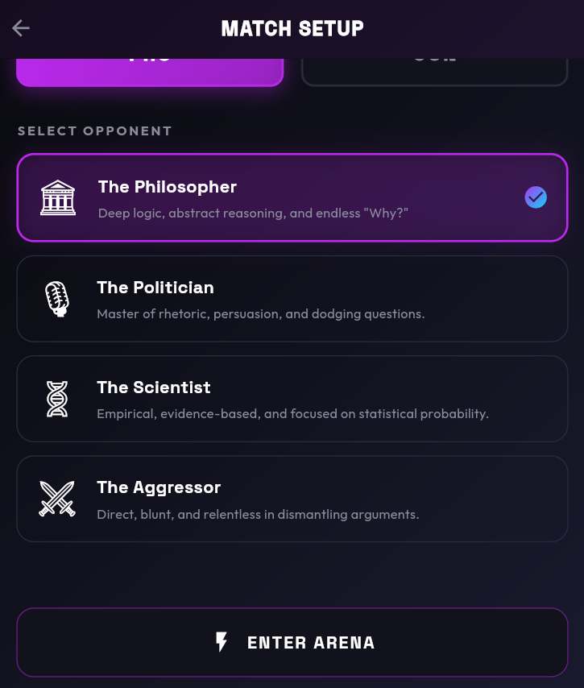
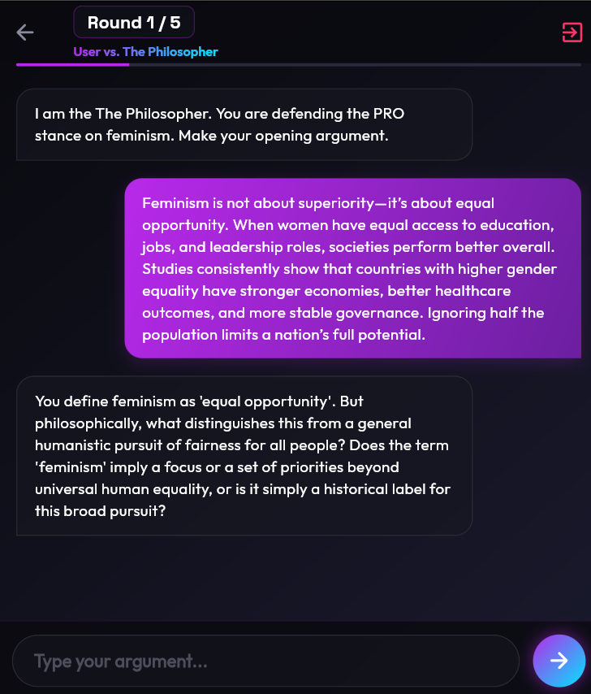
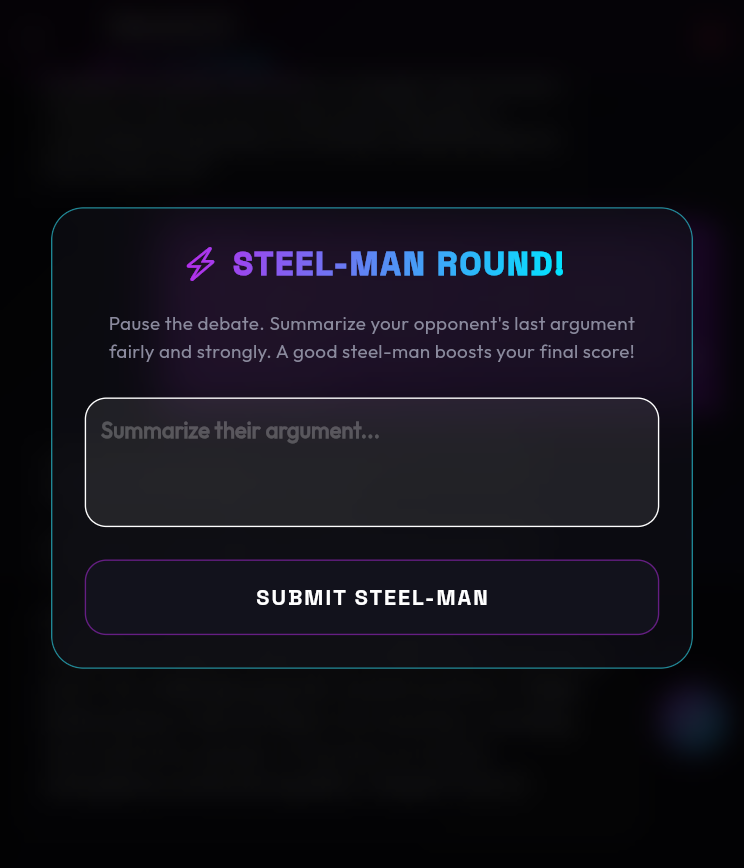
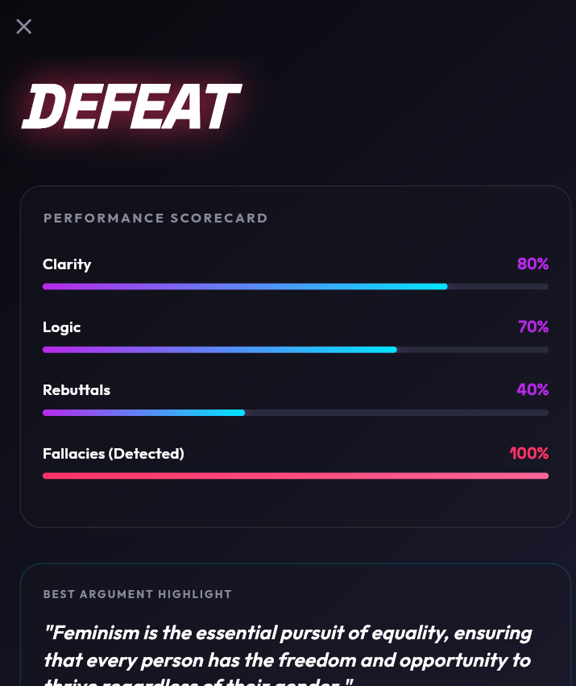
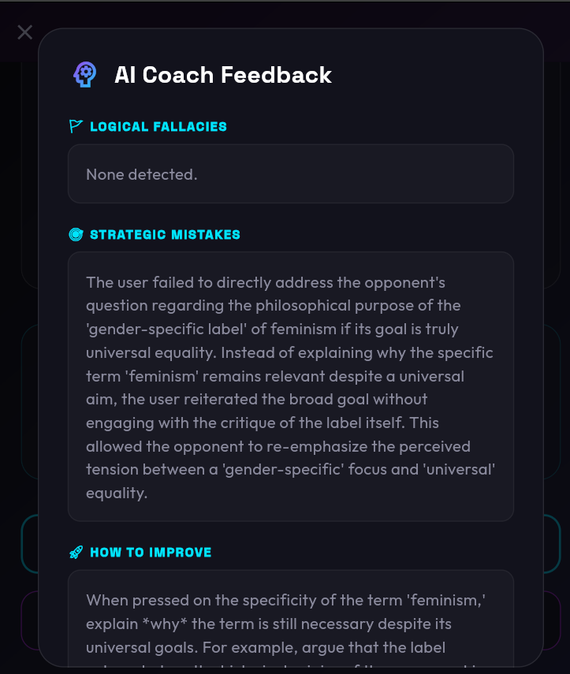

# ⚔️ DebateME — Gamified AI Debate Trainer



## 🎮 Overview

**DebateME** is a gamified, AI-powered debate training app built with Flutter. Battle adaptive AI personas in real-time debates, sharpen your rebuttal strategy with Steel-Man rounds, and track your Elo rating as you climb the global leaderboard.

Developed by **AbdulRehman (241-0911)**.

> **🔗 Try it live:** [debateme-15b75.web.app](https://debateme-15b75.web.app)

---

## ✨ Key Features

- **🤖 Adaptive AI Opponents**: Debate against four unique AI personas — The Philosopher, The Politician, The Scientist, and The Aggressor — each with a distinct debate style.
- **⚡ Steel-Man Rounds**: Mid-debate challenges that force you to summarize your opponent's argument fairly, boosting your final score.
- **📊 Performance Scorecard**: Post-match breakdown of Clarity, Logic, Rebuttals, and Fallacy Detection with percentage scores.
- **🧠 AI Coach Feedback**: Detailed analysis of logical fallacies, strategic mistakes, and actionable tips to improve.
- **🏆 Elo Rating & Leagues**: Competitive ranking system with global leaderboard tiers (Master, Diamond, etc.).
- **📅 Daily Challenges**: Auto-generated debate topics with countdown timers and stance assignments.
- **📈 Performance Hub**: Track win rate, active streaks, and Elo progression over time.

---

## 📸 Screenshots

| Home Dashboard | Daily Challenge | League Rankings |
|:---:|:---:|:---:|
|  |  |  |

| Match Setup | Opponent Selection | Debate Arena |
|:---:|:---:|:---:|
|  |  |  |

| Steel-Man Round | Scorecard | AI Coach Feedback |
|:---:|:---:|:---:|
|  |  |  |

---

## 🛠️ Tech Stack

| Layer | Technology |
| --- | --- |
| **Framework** | Flutter (Android, iOS, Web, Desktop) |
| **Auth & Database** | Firebase Auth + Cloud Firestore |
| **Local Storage** | Hive |
| **AI Engine** | Google Gemini API (`google_generative_ai`) |
| **State Management** | Provider |

---

## 🗂️ Project Structure

```
lib/
├── main.dart                  # App entry point
├── firebase_options.dart      # Firebase config
├── core/                      # Constants, theme, models
├── services/                  # AI service, API layer
├── widgets/                   # Reusable UI components
└── features/
    ├── splash/                # Splash screen
    ├── auth/                  # Login / Sign-up
    ├── home/                  # Dashboard & performance hub
    ├── arena/                 # Match setup & config
    ├── match_setup/           # Topic, stance, opponent selection
    ├── game/                  # Live debate arena
    ├── scorecard/             # Post-match results & coach analysis
    ├── history/               # Match history feed
    ├── league/                # Global leaderboard
    └── profile/               # User profile & stats
```

---

## 🚀 Getting Started

### Prerequisites
- **Flutter SDK** (stable channel)
- **Firebase** project configured (Auth + Firestore)
- **Gemini API key** from [Google AI Studio](https://aistudio.google.com/)

### Setup
1. **Clone the repository:**
   ```bash
   git clone https://github.com/Abdulrehman0911/DebateME.git
   cd DebateME
   ```
2. **Install dependencies:**
   ```bash
   flutter pub get
   ```
3. **Create your environment file:**
   ```bash
   cp .env.example .env
   ```
4. **Fill in `.env` values:**
   - `GEMINI_API_KEY` — your Google AI Studio key *(required)*
   - `GEMINI_MODEL` — model override *(optional, defaults to `gemini-2.5-flash`)*
5. **Run the app:**
   ```bash
   flutter run
   ```

---

## 🌐 Web Deployment (Firebase Hosting)

1. Build for web:
   ```bash
   flutter build web
   ```
2. Deploy:
   ```bash
   firebase deploy --only hosting
   ```

Hosted at: [debateme-15b75.web.app](https://debateme-15b75.web.app)

---

## 👨‍💻 Developer
- **Name**: AbdulRehman
- **Roll Number**: 241-0911

---

> [!IMPORTANT]
> Never commit your `.env` file. Use `.env.example` as a template for onboarding. Rotate API keys immediately if exposed.
